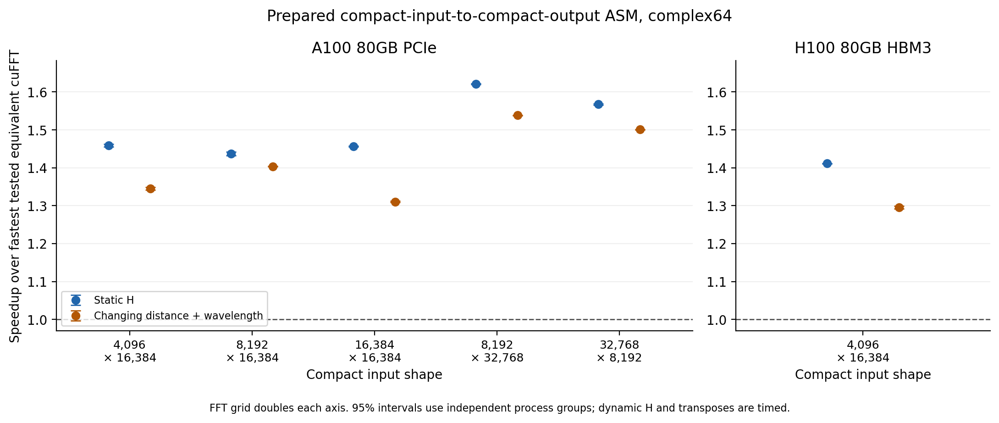
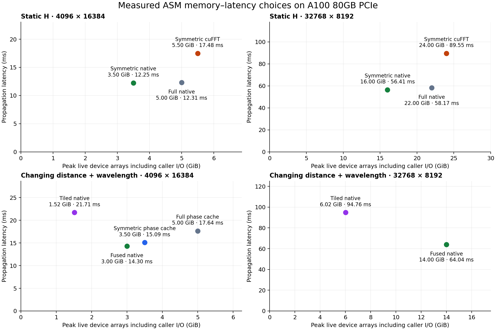

Prepared CUDA angular-spectrum propagation
==========================================

The experimental ``pyvkfft.asm.ASMPlan`` implements the discrete operator
``center_crop(ifft2(fft2(center_pad(x)) * H))`` for a complex64 compact input
of shape ``(h, w)`` and an FFT grid of shape ``(2*h, 2*w)``. Both the embedding
and crop begin at ``(h//2, w//2)``. The inverse includes ``1/(4*h*w)``
normalization. Input is preserved, including its full complex phase; no
approximation to the spatial impulse response is used.

This implementation is CUDA/CuPy only, experimental, and separate from the
installed FFT library. It supports radix plans with one or two uploads per
axis. Bluestein plans and three-upload axes are rejected. JAX, differentiation,
distributed execution, real transforms, and reduced precision are outside its
scope. The earlier ordinary-inverse upload-order correction is a separate
patch; native convolution does not require that correction.

Build and use
-------------

From the repository root, with the CUDA toolkit available::

    python examples/asm_build.py /absolute/fresh/build-directory --cuda "$CUDA_PATH"
    export PYVKFFT_ASM_LIBRARY=/absolute/fresh/build-directory/libvkfft_asm.so

The build copies VkFFT headers, inserts guarded hooks, and emits
``asm-hooks.patch``, a source snapshot, and a manifest with source, dependency,
hook, and library hashes. It does not edit the submodule or replace the
installed library. A fresh directory is required for every build. CUDA 12.x,
NVRTC, a C++17 host compiler, and a working NVIDIA driver are needed. The
Python/native ABI is checked before use.

Example with a precomputed transfer function::

    import cupy as cp
    from pyvkfft.asm import ASMPlan

    x = cp.asarray(input_array, dtype=cp.complex64)
    output = cp.empty_like(x)
    with ASMPlan(x.shape, (6.4e-6, 6.4e-6),
                 tuning_profile={"implementation": "native", "prune": True}) as plan:
        # H_gpu is complex64 on the doubled grid, in numpy.fft frequency order.
        plan.prepare_transfer(H_gpu)
        plan.execute(x, output)
        # GPU work is asynchronous; close synchronizes the bound stream.
    result = cp.asnumpy(output)

``order="centered"`` accepts a centered transfer function. Preparation copies
and permutes it once; retain the source until the bound stream completes that
copy. The plan owns only the packed execution representation.

For the analytic ASM transfer function at fixed optical parameters, avoid
allocating a source H array entirely::

    plan.prepare_asm_transfer(z=0.1, wavelength=532e-9)
    plan.execute(x, output)

This static-only method writes directly into the existing packed H storage,
using the plan's pixel pitch and band-limit policy. Calling it again replaces H;
subsequent execution still takes no optical parameters.

For changing distance and wavelength::

    with ASMPlan(x.shape, (6.4e-6, 6.4e-6), mode="dynamic",
                 bandlimit="rectangular",
                 tuning_profile={"implementation": "native", "prune": True,
                                 "transfer": "fused"}) as plan:
        plan.execute(x, output, z=0.1, wavelength=532e-9)
        plan.execute(x, output, z=0.2, wavelength=633e-9)

``z`` and wavelength are runtime scalars in meters; changing either performs
no recompilation. The fused strategy computes H at its FFT consumption point
and allocates no H array. ``transfer="materialized"`` regenerates the packed H
array on every execution. ``implementation="explicit"`` provides a control
using separate padding/cropping kernels and the existing VkFFT convolution
interface. That fallback conservatively rejects grids beyond the old installed
wrapper's signed 32-bit element-count limit.

Arrays must be contiguous complex64 CuPy arrays on the plan's device. Input
and output may not overlap. Keep them alive until execution completes. A plan
binds its device and stream at construction, serializes host submissions, and
uses preallocated GPU buffers. Independent streams require separate plans.
There is no automatic tuning or device synchronization inside ``execute``.
``close`` synchronizes the bound stream before releasing resources.

``plan.info`` records axis splits, uploads, kernel hashes, registers, shared
and local memory, theoretical resident blocks, workspace and transfer bytes,
and the library hash. Register/local-memory statistics describe compiled
kernels; local bytes alone do not establish register spilling. Eight compiled
kernels can correspond to seven launches because a duplicate inverse
convolution stage is not dispatched.

Transfer-function convention
----------------------------

Let ``fx, fy`` follow ``numpy.fft.fftfreq`` on the doubled grid, including its
negative even-size Nyquist bin. Define ``q = wavelength**-2 - (fx**2 + fy**2)``.
The coefficient is zero when ``q < 0``, otherwise
``exp(2j*pi*z*sqrt(q))``. Phase formation, square root, sine/cosine argument
reduction, and cutoff calculations use double precision; the coefficient is
complex64. Global phase is retained, including for negative z.

``bandlimit="rectangular"`` additionally keeps only
``abs(fx) <= 1/(wavelength*sqrt(1+(2*z/Lx)**2))`` and the corresponding y
condition, where ``Lx=2*w*dx`` and ``Ly=2*h*dy``. This explicit rectangular
policy is part of the operator definition. Static H is supplied verbatim and
is not modified by the dynamic band-limit policy.

Index mapping and safe pruning
------------------------------

The unreordered spectrum is a factor transpose on every two-upload axis:
a physical coordinate ``p`` represents frequency ``(p % a)*b + p//a``, with
``a*b`` equal to that axis length. Static packing and fused dynamic H both use
those same plan splits. The final integer specialization replaces runtime
divisors with their fixed plan values; it does not change optical arithmetic.

The first row-FFT reads compact input directly and supplies zeros outside its
support. The last inverse row stage writes only the compact crop. Both avoid
standalone full-grid padding and cropping traffic.

Pruning skips whole independent row transforms, with a dependency argument:

* Before the row FFT, only the central h rows contain input. Every omitted row
  is identically zero. Row transforms do not mix different rows.
* The first column stage explicitly supplies zero for omitted rows; it never
  reads stale workspace there. Column FFTs still cover their full padded
  length and every required frequency.
* After inverse column transforms, only the central h spatial rows feed the
  requested final row transforms. Other column output rows are not stored.
* Final row inverses run on those h rows and write their central w samples.

For two-upload rows the grid's row dimension is halved and offset by h//2.
For one-upload rows this is enabled only when both h and h//2 align to whole
row batches. Otherwise the full row grid remains, with boundary masks. No
frequency is discarded because padding is zero. Dirty/NaN workspace tests
check the zero synthesis explicitly.

A padded complex64 workspace remains necessary. With S bytes per padded grid,
static or materialized-H plans own 2S bytes; fused dynamic-H plans own S bytes,
plus any reported VkFFT scratch. Compact input/output add S/2 bytes total.
Zero FFT scratch does not imply zero intermediate storage. Benchmark baselines
and reference buffers add further allocations, all reported separately.

Validation and reproduction
---------------------------

Run the tests directly to avoid this fork's unrelated test-package import of
an unavailable OpenCL backend::

    CUDA_VISIBLE_DEVICES=<authorized-GPU-UUID> python pyvkfft/test/test_asm.py

Tests compare against a complex128 NumPy pad/FFT/H/IFFT/crop reference. They
cover arbitrary-amplitude static H, FFT/centered order, odd and even rectangles,
one/two-upload transitions, zeros, edge/center impulses, identity, phase fields,
a compact spatial-filter control, changing z/wavelength, negative distance,
evanescent cutoff bins, both mask policies, dirty workspace, replacement input
and output pointers, nondefault streams, allocation stability, and API errors.
Independent coefficient tests precede propagation comparisons. Nonzero outputs
require relative L2 <= 2e-5 and scaled maximum error <= 1e-4; zero outputs are
checked separately. Tolerances are unchanged for optimized variants.

Completed local validation includes 10 core test methods, one axis-order
method, three cuFFT-baseline methods, and five optional phase-cache methods,
each with multiple fixtures. Twelve large-grid reference fixtures across all
five requested shapes reached maximum relative L2 1.061e-6 and scaled maximum
error 1.282e-6. H100 memcheck and racecheck reported zero errors/hazards for the
ordinary backend, the column wrapper, and the four-method cached-phase
snapshot. A later fifth phase test verifies reverse wrong-library rejection
locally; this Python constructor guard does not alter native execution.

The complete Sphinx HTML build succeeds with existing repository documentation
diagnostics. Both new RST reports also pass strict parsing independently.

``src/vkfft_cuda.cu`` separately replaces signed-int element products with
checked uint64 arithmetic. A configuration-only regression verified 2^31 and
2^32 elements (16 and 32 GiB complex64), and rejection of overflow, zero, and
negative dimensions, without allocating those arrays.

Benchmark compact input/output with all reusable preparation excluded::

    export LD_LIBRARY_PATH="$CUDA_PATH/targets/x86_64-linux/lib:$LD_LIBRARY_PATH"
    python examples/asm_benchmark.py --gpu 3 --shape 4096 16384 \
        --mode dynamic_both --bandlimit none \
        --variants cufft cufft_eval cufft_callback cufft_padding cufft_pruned \
                   vkfft_pruned_fused_h \
        --cufft-library "$CUDA_PATH/targets/x86_64-linux/lib/libcufft.so.11" \
        --rounds 4 --seconds-per-block 5 --output result.json

Adjust toolkit paths for system CUDA (typically ``lib64``). Select a fresh
CuPy cache after changing CUDA toolchains to avoid reusing incompatible LTO
artifacts. Only local GPUs 1--3 are authorized in this study; ``--slurm`` uses
Orix's assigned visibility unchanged. Memory preflight and post-planning checks
limit study allocations to 80% of initially available VRAM; split variants
into separate processes for the largest grids.

All variants read the same immutable input on every iteration. Repeatedly
propagating the previous cropped output would measure an attenuating sequence
and is not used. Dynamic H generation and parameter updates are included.
``--include-core`` separately measures dense prepared-padded-buffer cuFFT
execution; compact fused/pruned kernels have no separable dense core and are
explicitly marked unavailable. Profiler replay durations are never used as
headline timings.

The cuFFT controls include dense materialized H, H evaluation fused into
multiplication, LTO H callbacks, boundary callbacks when supported, and a
separable pruned composition. That composition retains h row FFTs, full column
FFTs, and h inverse row FFTs; tiled transpose/embed/crop kernels make its memory
accesses coalesced. The fastest correct supported alternative is the baseline
for each workload. Callback failures are recorded with their planning stage;
they are not silently omitted or treated as a mathematical limitation.

Tuning and bounded alternatives
-------------------------------

The initial matched A100 screens separate boundary fusion and pruning. These
are development ablations, using the same early build within each row; they
are not final comparisons against the subsequently improved cuFFT baseline.

.. list-table:: Compact 4096 x 16384 development ablations
   :header-rows: 1

   * - Mode
     - Explicit boundaries (ms)
     - Fused boundaries (ms)
     - Plus row pruning (ms)
   * - Static H
     - 22.048
     - 17.842
     - 12.913
   * - Dynamic, materialized H
     - Not in this matched run
     - 24.200
     - 19.104
   * - Dynamic, fused H
     - Not applicable
     - 21.098
     - 16.015

Within the dynamic run, fusing H evaluation reduced the pruned operator from
19.104 to 16.015 ms. Later integer specialization and tuning improved that
path further. Raw development runs are ``static-pruned-initial.json`` and
``dynamic-pruned-initial.json`` in the study artifact directory.

On the A100 primary compact grid 4096 x 16384, fourteen candidates per transfer
mode varied target threads (64/128/256/512), coalesced bytes (32/64/128), and
per-axis batches (4/8/16/32). Every candidate passed correctness with poisoned
workspace. Generated-code hashes identify settings that did not change the
actual kernels. The selected explicit profile is ``groupedBatch=[0,32]``;
this is not a global default for other shapes or GPUs.

Three fresh processes, each with four alternating five-second blocks, gave:

.. list-table:: Native implementation ablations on A100
   :header-rows: 1

   * - Change
     - Before (ms)
     - After (ms)
     - Speedup, 95% CI
   * - Static: default to grouped32
     - 12.9867
     - 12.3265
     - 1.0536 [1.0502, 1.0569]
   * - Dynamic: runtime layout mapping to fixed mapping plus grouped32
     - 16.1279
     - 14.2214
     - 1.1341 [1.1337, 1.1344]

These are native-to-native comparisons with fixed optical parameters, not
cuFFT claims. Dynamic parameter changes are measured separately. Confidence
intervals use independent process aggregates rather than treating correlated
iterations as independent samples. Final cuFFT comparisons use their own
matched runs.

The specialized dynamic kernel uses 62 registers versus 66 and allows eight
rather than seven theoretical resident blocks at 128 threads. Its 48 local
bytes remain unchanged. The selected static grouping uses more registers and
shared memory, and fewer resident blocks, yet runs faster. Occupancy alone is
therefore not the optimization objective.

Additional isolated builds tested twiddle LUTs, registerBoost 2/4, and a 64-KiB
planner shared-memory budget. The boost and shared-budget settings produced
identical kernels and splits. LUTs passed accuracy but screened at 12.689 ms,
slower than grouped32 without LUTs, so were not selected.

For distance-only updates, a separate prototype prepared an FP64 ``sqrt(q)``
table and regenerated H from it. A compact one-dimensional frequency-table
prototype was also tested. Full propagation on random input screened as:

.. list-table:: Dynamic H alternatives, primary A100 grid
   :header-rows: 1

   * - Strategy
     - Execution (ms)
     - Extra prepared data
   * - Fused evaluation
     - 13.94
     - None
   * - Materialized H, recomputed
     - 18.04
     - None beyond H
   * - Materialized H, cached sqrt(q)
     - 14.93
     - 2 GiB FP64 table
   * - Materialized H, one-dimensional frequency tables
     - 16.78
     - 320 KiB

The full phase-table preparation cost was 3.77 ms and would recur after a
wavelength change. Coefficients matched the reference within the unchanged
error limits. Neither table strategy beat fused evaluation, so these remain
explicit research scripts rather than new persistent API state. These short
screens are not used as confidence-qualified performance claims.

Directly combining the remaining multi-upload FFT kernels is not a legal
textual fusion: their stages exchange data between different block groups.
For the primary grid, a full 32768-complex row occupies 256 KiB, exceeding the
A100's measured per-block opt-in shared-memory limit. Keeping all those values
in registers would consume its full 65536-register SM file before twiddles,
indices, and temporaries. A current 16-column tile would require 1 MiB.
Changing that schedule requires a new dependency/residency design; simply
removing a launch boundary is incorrect. The existing terminal-column
FFT/multiply/initial-inverse fusion already retains its local subtransform
on chip. No unproven cross-block or H100-cluster fusion is enabled.

Symmetric CUDA Graph replay was also screened. On the primary static grid,
cuFFT's separable operator changed from 18.224 to 18.218 ms and the tuned
native operator from 12.312 to 12.300 ms. Neither reaches the 3% promotion
threshold. Graph replay helps tiny launch-bound fixtures but is not selected
for these large grids. Dynamic graph screening fixes captured scalar values;
it must not be reported as a changing-parameter workload.

Stock zero-padding controls
---------------------------

The existing ``performZeropadding`` controls already provide useful work
avoidance. Their ``[fft_zeropad_left, fft_zeropad_right)`` interval is the region
to suppress, rather than the compact input support. The planner couples forward
read and inverse write masks. One interval cannot directly describe the two
outer margins of a centered embedding.

However, simultaneous translation of embedding and crop leaves circular
convolution unchanged. Embedding in the leading corner and cropping that same
corner therefore implements the identical compact operator, with a single
trailing zero interval on each axis. ``examples/asm_stock_zeropad.py`` verifies
this equivalence with arbitrary complex H and poisoned workspace. The stock
flags passed on the primary grid at relative L2 2.95e-7. They screened at
14.85 ms including compact copies, compared with 12.88 ms for the new default
native pruned path in that run. This existing optimization is a meaningful
baseline; the new work adds direct compact boundary access, reduced dispatch,
and dynamic coefficient fusion rather than claiming to invent all zero-work
avoidance. The original full-grid explicit-padding control remains useful as
an ablation, but is not the strongest VkFFT baseline.

Explicit axis-order and phase-cache profiles
--------------------------------------------

``tuning_profile={"implementation": "native", "prune": True,
"axis_order": "column"}`` selects a transposed internal plan. Both compact
input and output transposes are included in execution, and pixel pitches are
reversed with the axes. Static H preparation packs directly from the original
axes. Native plans reuse one private compact transpose buffer, costing one
quarter of a padded grid; explicit plans use two buffers.
The default stays row-first; changing axis order is an explicit measured choice.

On the tall compact 32768 x 8192 grid, three independent processes with four
alternating nominal five-second blocks verified a static improvement from
63.514 to 58.048 ms (1.0914x, 95% CI 1.0780--1.1049), and a fixed-parameter
dynamic improvement from 71.997 to 62.827 ms (1.1455x, CI 1.1425--1.1485).
The primary wide grid regressed with column order, so keeps row order. cuFFT's
separable composition also benefits from column order on the tall grid; final
library comparisons must let both implementations select their faster order.

A separate optional backend supports ``transfer="cached_phase"`` for dynamic
ASM without a rectangular band limit::

    python examples/asm_cached_phase_build.py /absolute/native-build /absolute/phase-build
    export PYVKFFT_ASM_PHASE_LIBRARY=/absolute/phase-build/libvkfft_cached_phase.so

    plan = ASMPlan((4096, 16384), (6.4e-6, 6.4e-6), mode="dynamic",
                   tuning_profile={"implementation": "native", "prune": True,
                                   "transfer": "cached_phase", "groupedBatch": [0, 32]})

It stores FP64 ``sqrt(q)`` in the native FFT layout and reads that table inside
the fused transition, avoiding materialized complex H. Evanescent entries use
a negative sentinel and remain zero. Every change to the exact wavelength
rebuilds the table on the bound stream inside ``execute``; changing only z
reuses it. ``plan.info`` reports table bytes, the prepared wavelength, and the
preparation count. No device allocation or synchronization is added to
execution. The dedicated library retains the native opaque ABI and adds its
own checked capability marker, so an ordinary library cannot be mistaken for
the phase-table backend.

At the primary A100 shape with changing distance and fixed wavelength,
three independent processes with four alternating five-second blocks measured
14.1284 ms for ordinary fused evaluation and 13.4377 ms for cached phase:
1.05120x, 95% CI 1.04944--1.05296. This validates the exact public optional
backend binary, separately from the earlier research prototype. The extra FP64 table is 2 GiB and wavelength
invalidation costs approximately 3.83 ms in the screened fixture. A short changing-wavelength screen measured 17.415 ms for the cached strategy
versus 13.982 ms for ordinary fused evaluation, a 24.6% regression. This
strategy is intended for distance-dominant workloads. A phase-cached cuFFT
variant was not benchmarked, so this 5.1% result is a native-to-native claim. Static mode, rectangular band limits, and CUDA Graph
capture are explicitly rejected by this optional backend. Ordinary fused
execution continues to support both mask policies and changing wavelengths.

Final sustained comparisons
---------------------------

These completed comparisons use CUDA 12.9, cuFFT 11.4.1, CuPy 14.0.1, and
VkFFT runtime 1.3.5. Shapes below are compact inputs; each FFT dimension is
twice as large. All rows measure the complete complex64 compact operator with
``bandlimit="none"``. Dynamic rows cycle both z (0.01, 0.1, 1 m) and wavelength
(450, 532, 633 nm). Both mask policies have correctness and screening coverage,
but the sustained performance matrix here is for the unmasked operator.

The primary A100 uses its explicit grouped32 profile; other A100 cases use
default grouping, with column-first order for the tall input. H100 uses default
grouping and row order. cuFFT independently selects its faster tested order
and crop implementation. Reusable compilation, allocation, planning, and
static H preparation are excluded. Required per-call transposes, dynamic H
updates, and all padding/cropping work are included.

.. list-table:: Fastest tested equivalent cuFFT versus selected native implementation
   :header-rows: 1

   * - GPU
     - Compact shape
     - Mode
     - cuFFT ms
     - Native ms
     - Speedup [95% CI]

   * - A100
     - 4096 x 16384
     - Static H
     - 17.983
     - 12.325
     - 1.4585 [1.4547, 1.4623]

   * - A100
     - 4096 x 16384
     - Changing z and wavelength
     - 19.038
     - 14.134
     - 1.3451 [1.3419, 1.3484]

   * - A100
     - 8192 x 16384
     - Static H
     - 39.909
     - 27.751
     - 1.4373 [1.4322, 1.4425]

   * - A100
     - 8192 x 16384
     - Changing z and wavelength
     - 41.570
     - 29.619
     - 1.4034 [1.4027, 1.4042]

   * - A100
     - 16384 x 16384
     - Static H
     - 87.515
     - 60.070
     - 1.4566 [1.4552, 1.4579]

   * - A100
     - 16384 x 16384
     - Changing z and wavelength
     - 90.606
     - 69.193
     - 1.3104 [1.3084, 1.3123]

   * - A100
     - 8192 x 32768
     - Static H
     - 86.132
     - 53.131
     - 1.6211 [1.6197, 1.6225]

   * - A100
     - 8192 x 32768
     - Changing z and wavelength
     - 89.676
     - 58.296
     - 1.5383 [1.5376, 1.5390]

   * - A100
     - 32768 x 8192
     - Static H
     - 91.414
     - 58.322
     - 1.5674 [1.5659, 1.5689]

   * - A100
     - 32768 x 8192
     - Changing z and wavelength
     - 95.471
     - 63.606
     - 1.5010 [1.5003, 1.5017]

   * - H100
     - 4096 x 16384
     - Static H
     - 10.002
     - 7.088
     - 1.4112 [1.4110, 1.4114]

   * - H100
     - 4096 x 16384
     - Changing z and wavelength
     - 9.790
     - 7.558
     - 1.2954 [1.2915, 1.2992]

Primary and medium-grid rows use three independent processes, each with four
alternating blocks of at least five seconds per implementation. The largest
grids use twelve independent fresh-process pairs with one five-second block
per implementation and alternating order, keeping only one variant's plans
resident at a time. Confidence intervals use independent process aggregates;
the raw summaries specify each estimator. Individual iterations are not
independent statistical samples.

The local A100 steady-block telemetry retains only samples at least 0.5 seconds
from each block edge, excluding setup and gaps. Every retained sample reports
100% GPU utilization. Raw transition samples remain available. The H100 probe
lacks timestamped block bounds, so no equivalent bounded utilization statistic
is inferred. GPU utilization measures activity, not peak bandwidth or FLOPS.

The tested cuFFT alternatives include known-shape specialization, separable
pruning, both axis orders, and inverse-crop callbacks. On the tall static case,
the row-crop screen exceeded the benchmark harness's memory guard; its column
equivalents were measured. This is a harness limitation, not a cuFFT capability
claim. All reported finalists remain below the 80% VRAM guard.

Raw timing blocks, candidate screens, profiler reports, and source fingerprints
are indexed in the workspace's ``asm-results/final-report/README.rst`` and
``summary.json``. Development runs using the earlier runtime-constant cuFFT
helper remain as ablations and are not mixed into this table. The last Python
constructor guard rejects a mistakenly selected phase-library backend; its
separate provenance record preserves the earlier timing snapshots. It does
not change successful execution or generated native kernels.

Profiler evidence and remaining bottlenecks
-------------------------------------------

The final H100 captures compare the specialized separable cuFFT composition
with its inverse-crop callback against the native pruned operator, on compact
4096 x 16384. All values below are hardware-counter evidence from profiler
replay, separate from the sustained headline timings.

.. list-table:: H100 complete-operator counters
   :header-rows: 1

   * - Mode
     - cuFFT DRAM read + write (GiB)
     - Native DRAM read + write (GiB)
     - Reduction
     - Launches, cuFFT / native
   * - Static H
     - 26.558
     - 18.870
     - 28.95%
     - 9 / 7
   * - Changing z and wavelength
     - 24.555
     - 16.867
     - 31.31%
     - 9 / 7

The `complete stage table <_static/asm-profile-stages.csv>`_ records both libraries,
both modes, replay time, read/write bytes, register count, shared-memory bytes,
achieved warp occupancy, DRAM throughput, local-memory transactions, and the
largest sampled stall ratio. For the native dynamic path its seven launches
are:

.. list-table:: H100 native dynamic stages
   :header-rows: 1

   * - Stage
     - Replay ms
     - DRAM GiB
     - Registers/thread
     - Shared KiB/block
     - Active warps (%)
   * - Compact load / first forward row stage
     - 0.554
     - 1.479
     - 32
     - 9
     - 96.9
   * - Complete forward rows
     - 0.706
     - 1.981
     - 48
     - 5.25
     - 58.5
   * - First forward column stage
     - 1.225
     - 2.980
     - 32
     - 9
     - 96.7
   * - Fused column FFT / H / inverse transition
     - 3.174
     - 3.979
     - 64
     - 17
     - 49.6
   * - Complete inverse columns / retain required rows
     - 1.129
     - 2.983
     - 32
     - 9
     - 96.1
   * - First inverse row stage
     - 0.709
     - 1.980
     - 48
     - 5.25
     - 58.7
   * - Complete inverse rows / compact crop
     - 0.519
     - 1.484
     - 32
     - 9
     - 95.9

Most stages are dominated by long-scoreboard stalls and reach approximately
78--91% of peak DRAM throughput. The dynamic fused transition reaches about
40% of peak DRAM throughput and its largest sampled stall category is
``no_instruction``. This supports a remaining instruction/phase-evaluation
bottleneck in that stage, rather than assuming all kernels are bandwidth
limited. The native captures report zero local-memory sectors. cuFFT reports
approximately 132 million local-memory sectors; these include all local-memory
traffic and must not automatically be labeled register spills.

The compact boundary hooks, row pruning, and fused spectral transition remove
traffic and dispatches while preserving global synchronization where different
blocks exchange FFT results. Further speedups require a new legal decomposition
or cheaper equally accurate phase evaluation; occupancy or launch count alone
does not establish an improvement.

Isolated memory measurements
----------------------------

``examples/asm_memory_probe.py`` measures construction, static preparation, and
one prepared execution in a fresh process. It records the CuPy allocator's
live high-water mark at every allocation, plus sampled driver-memory deltas.
Compact input and output are included; benchmark reference buffers are absent.
The original static H is released after preparation and unused pool blocks are
returned before reporting prepared residency. These are array/workspace peaks,
not a guaranteed capture of every short-lived internal CUDA/compiler allocation.

For compact 16384 x 16384, the padded complex64 grid is 8 GiB:

.. list-table:: Isolated square-case memory, GiB
   :header-rows: 1

   * - Mode
     - Implementation
     - Prepared live memory
     - Peak including preparation
   * - Static
     - cuFFT, fastest tested crop callback
     - 28
     - 36
   * - Static
     - cuFFT, explicit crop
     - 24
     - 32
   * - Static
     - Native VkFFT
     - 20
     - 28
   * - Dynamic fused H
     - cuFFT, fastest tested crop callback
     - 20
     - 20
   * - Dynamic fused H
     - cuFFT, explicit crop
     - 16
     - 16
   * - Dynamic fused H
     - Native VkFFT
     - 12
     - 12

The explicit-crop cuFFT alternative avoids 4 GiB of callback-plan scratch on
this shape. Its prior timing screen was about 1.1% slower for static H and 0.4%
slower for dynamic H, so the fastest baseline is not the lowest-memory baseline.
Even against this leaner tested composition, native prepared storage is 16.7%
lower for static H and 25% lower for dynamic H. This does not prove optimality
against all possible cuFFT schedules.

The initial tall compact 32768 x 8192 audit exposed a larger native preparation
peak: 40 GiB versus 32 GiB for column-first cuFFT. Two subsequent changes remove
the full transposed H temporary and reuse one private compact buffer. Analytic
static preparation can additionally eliminate the external H allocation:

.. list-table:: Native memory after the follow-up changes, GiB
   :header-rows: 1

   * - Compact shape / mode
     - Previous prepared / peak
     - Current prepared / peak
   * - 32768 x 8192, column, supplied static H
     - 24 / 40
     - 22 / 30
   * - 32768 x 8192, column, analytic static H
     - 24 / 40
     - 22 / 22
   * - 32768 x 8192, column, fused dynamic H
     - 16 / 16
     - 14 / 14
   * - 16384 x 16384, row, analytic static H
     - 20 / 28
     - 20 / 20

The previous analytic rows refer to generating an external H and then copying
it into the plan. The previous dynamic column value follows the original
allocation layout; current values are isolated measurements. Supplied-H and
analytic static preparation preserve the same propagation operator. Relative
to the measured 32 GiB tall static cuFFT peak, the current native peaks are
6.25% lower with arbitrary supplied H and 31.25% lower with analytic generation.
The latter also removes the caller's H-generation allocation, so its advantage
depends on using the new analytic API.

The direct pack exchanges two factor-index digits through a 32 x 33 shared
memory tile, coalescing both source loads and destination stores. Smaller
factor dimensions use the direct gather fallback. Both frequency orders and
partial tiles are covered; the complete 8 GiB packed result matches the legacy
transpose-then-pack output bit for bit. Three fresh processes with four
alternating five-second blocks each measured 25.544 ms for legacy preparation
versus 10.481 ms for tiled preparation: 2.437x faster, with a paired-process
95% confidence interval of 2.404--2.471x. The legacy temporary was preallocated,
so this measures GPU preparation kernels, excluding planning and allocation.
All 948 telemetry samples inside the trimmed block windows reported 100% GPU
activity. This is a one-time preparation gain, not a per-call propagation gain.
A simple strided direct gather saved memory but was slower and was replaced by
this tiled version.

One-buffer reuse applies to native plans, including phase-cache variants. Their first FFT
kernel finishes reading private compact scratch before their final FFT kernel
writes it; all launches use the same stream. Caller input/output still cannot
overlap. Full tall random outputs match the two-buffer baseline bit for bit.
Three fresh paired processes, each with four alternating five-second blocks,
measured 58.287 versus 58.326 ms for static execution and 63.668 versus 63.660 ms
for dynamic execution. The 95% confidence intervals bound possible slowdown
at 0.403% and 0.071%, respectively: the measured benefit is memory, with no
established propagation speedup. Historical library-comparison timings above
retain their original binaries and fingerprints.

For the row-first native schedule, with S bytes per padded grid, compact
input/output consume S/2, workspace consumes S, and materialized H consumes S.
Fused dynamic evaluation therefore needs 1.5S; static materialization needs
2.5S after preparation. Ordinary native column wrapping now adds S/4, giving
1.75S dynamic and 2.75S static. The optional FP64 phase cache adds S and should
be disabled when minimizing memory. The symmetric cache described below
reduces the table to approximately S/4. Native column wrappers use one compact
buffer; the explicit wrapper uses two.

Further compute experiments were not promoted: mapping both compact boundaries
directly into column FFTs regressed about 14%; input-only and output-only
variants also regressed. Hoisting optical constants improved native latency
only about 1.1% in its screen, below the predeclared 3% promotion threshold;
an alternative FP64 sincospi formulation and additional tall FFT group settings
also failed that threshold. These experiments retain the exact phase convention
and their raw correctness/timing artifacts.

The original eight isolated runs and source hashes remain in
``asm-results/memory-audit/``; follow-up probes and preparation timings are in
``asm-results/memory-optimized/``. Dynamic cuFFT receives a tiny unused H argument
instead of retaining the performance harness's full reference H array, since
its coefficient-evaluation kernel does not read that argument. Memory figures
include caller compact input/output but exclude unrelated benchmark reference
arrays. No installed FFT library or VkFFT submodule was replaced.

Exact symmetry storage for analytic ASM
---------------------------------------

The analytic coefficient satisfies ``H(ky,kx)=H(-ky,kx)=H(ky,-kx)``, including
its complex phase. The same symmetry holds for ``sqrt(q)`` and the rectangular
band limit. The positive-frequency quadrant, including both Nyquist edges,
therefore represents the complete transfer function exactly. This reduces
large transfer tables to approximately one quarter of their original storage.

Build the optional common static-H/cached-phase backend from the ordinary
isolated build directory::

    python examples/asm_symmetric_build.py /absolute/base-build /absolute/symmetric-build
    export PYVKFFT_ASM_SYMMETRIC_LIBRARY=/absolute/symmetric-build/libvkfft_symmetric.so

For fixed analytic H, select the new storage explicitly::

    with ASMPlan(x.shape, (6.4e-6, 6.4e-6), mode="static",
                 tuning_profile={"implementation": "native", "prune": True,
                                 "transfer": "symmetric"}) as plan:
        plan.prepare_asm_transfer(z=0.1, wavelength=532e-9)
        plan.execute(x, output)

This profile accepts analytic preparation through ``prepare_asm_transfer``.
Use materialized storage for an arbitrary supplied H array. Both band-limit
policies and both axis orders are supported. Column order reuses the same
single private compact buffer as ordinary native propagation.

For distance-dominant dynamic workloads, the same library supports
``transfer="cached_phase_symmetric"``. It stores FP64 ``sqrt(q)`` in the compact
layout and regenerates it inside execution whenever wavelength changes.
As with the full phase cache, it supports ``bandlimit="none"`` and rejects
CUDA Graph capture. Full phase storage remains available as ``cached_phase``
through its existing separate library. All native column profiles now reuse
one private compact buffer, including both phase-cache variants.

A natural quadrant layout introduced costly strided reads. The selected layout
instead follows each axis's FFT factor permutation. For a positive frequency
``k=c*b+d`` and factorization ``N=a*b``, let ``t=a//2``. Frequencies with ``c<t``
have table rank ``d*t+c``; the remaining Nyquist-edge row has rank ``t*b+d``.
Native reads fold signs directly in the factor coordinates before applying
this rank. Flat addresses remain 64-bit; 32-bit coordinate arithmetic is used
only when both axis lengths fit. Table rows are aligned to 32 entries when
they contain at least 1024 logical entries. Short rows retain their exact
length. Preparation writes directly into this layout without a full H or
phase-table intermediate.

The public static tests cover 336 independent numerical fixtures and 36
bitwise comparisons with full stored H. Cached-phase tests include 96
compressed-table/operator fixtures and the original full-cache cases. The
compressed tables expand bit for bit to their full-table counterparts.
All backends validate capability and layout versions, including rejection of
ordinary/full-cache/symmetric libraries selected through the wrong profile.

Equivalent quadrant storage is also available to the cuFFT comparison through
``examples/asm_cufft_symmetric.py``. Symmetry is a property of the ASM operator;
matched library comparisons give both backends that storage option. The
original comparison matrix above retains its original binaries and results.

Final A100 measurements for static symmetry
~~~~~~~~~~~~~~~~~~~~~~~~~~~~~~~~~~~~~~~~~~~

Three fresh processes per comparison used four alternating five-second
blocks. Confidence intervals use paired process-level log ratios; every
sample in the block interiors (0.5 seconds trimmed at each edge) reported
100% GPU activity. These are activity samples, not kernel occupancy.

.. list-table:: Static propagation, analytic H prepared before timing
   :header-rows: 1

   * - Compact shape
     - Full-table native
     - Symmetric native
     - Speedup (95% CI)
   * - 4096 x 16384, row order
     - 12.310 ms
     - 12.248 ms
     - 1.005x (0.999--1.012x)
   * - 32768 x 8192, column order
     - 58.170 ms
     - 56.406 ms
     - 1.031x (1.030--1.032x)

There is no established primary-shape speed improvement. The tall-shape
improvement passes the predeclared 3% speed threshold. In separate matched
comparisons with both backends using symmetric H, cuFFT 11.4.1 measured
17.480 ms versus native 12.248 ms on the primary shape, and 89.551 ms versus
56.665 ms on the tall shape: speedups of 1.426x (1.411--1.441x) and 1.580x
(1.577--1.584x). The primary cuFFT control uses the faster crop callback;
the tall control uses the faster explicit crop. Both tall implementations
reuse one private compact buffer.

.. list-table:: Fresh-process peak live device arrays, GiB
   :header-rows: 1

   * - Compact shape
     - Native full static
     - Native symmetric static
     - Native fused dynamic
     - cuFFT symmetric static
   * - 4096 x 16384
     - 5.000
     - 3.501
     - 3.000
     - 5.500 (callback); 4.500 (explicit)
   * - 32768 x 8192
     - 22.000
     - 16.002
     - 14.000
     - 24.000 (explicit)
   * - 16384 x 16384
     - 20.000
     - 14.004
     - 12.000
     - Not remeasured

These figures include caller input/output, construction, preparation and
execution, and exclude the CUDA context. Static H is prepared analytically;
supplying an existing full H array has a different preparation peak.
The square full/dynamic figures come from the preceding memory audit;
the other native entries and both compressed cuFFT controls are fresh probes.
FP64 symmetric phase caches have the same array footprint as symmetric static
H. Full phase caches have the same footprint as full static H. Sampled driver
allocation deltas are retained separately from array counts.

The telemetry-backed phase-cache comparison also used three fresh processes
and four rotating five-second blocks per variant. With fixed wavelength,
full cache / symmetric cache / direct fused evaluation measured
13.397 / 13.791 / 14.169 ms. Symmetric storage used 3.501 GiB instead of
5.000 GiB, with a 2.94% latency cost relative to full caching (95% interval
2.83--3.05%). It is an explicit intermediate memory/speed choice.
When wavelength changed on every call, including table regeneration, the
same variants measured 17.641 / 15.088 / 14.202 ms. Compression accelerates
rebuilding the cache, but direct fused evaluation remains fastest and uses
3.000 GiB. Compressed and full-cache outputs match bit for bit.
All 72 block interiors passed the activity gate: the lowest sample was 99%,
the lowest block mean was 99.95%, and all changing-wavelength samples were
100%. The 2,888 retained samples and excluded edges remain in the raw records.

Capacity-oriented tiled propagation
-----------------------------------

``StreamedASMPlan`` is an optional exact complex64 implementation for callers
who accept longer execution to reduce memory. It stores only half of the
intermediate spectrum at a time, reuses caller output for the other half,
and performs the padded FFTs in tiles. It evaluates the full complex analytic
coefficient, including evanescent rejection and optional rectangular limits.
It supports changing distance and wavelength on every call.

Build its independent ordinary-FFT backend and select it explicitly::

    python examples/asm_streamed_build.py /absolute/streamed-build --cuda "$CUDA_PATH"
    export PYVKFFT_STREAMED_LIBRARY=/absolute/streamed-build/libvkfft_streamed.so

    from pyvkfft.asm_streamed import StreamedASMPlan

    with StreamedASMPlan(x.shape, (6.4e-6, 6.4e-6), tile_columns=256) as plan:
        plan.execute(x, output, z=0.1, wavelength=532e-9)
        plan.stream.synchronize()

Input and output must be distinct contiguous CuPy complex64 arrays. Input is
preserved; output contains intermediate data until the bound stream finishes.
Execution allocates no GPU arrays, and host submissions are serialized on the
plan's stream. Closing a plan waits for its queued work. Radix FFTs with one
or two uploads are supported; unsupported Bluestein and larger upload counts
fail explicitly. The staged headers include the inverse-upload ordering fix;
the installed library and VkFFT submodule remain unchanged.

For compact H x W, row-tile count R and column-tile count B, device storage
including caller input/output is ``3*H*W*8 + max(R*2*W, B*2*H)*8`` bytes plus
any FFT scratch reported by the initialized plans. ``tile_rows=None`` fits
row tiles into the column-tile allocation. The primary row-order profile uses
``tile_columns=256``; the tall profile uses 32. Column order is available as
an explicit alternative, but did not improve these measured shapes.

.. list-table:: Final sustained dynamic comparison, changing distance and wavelength
   :header-rows: 1

   * - Compact shape
     - Fused native, ms / GiB
     - Tiled native, ms / GiB
     - Tiled/fused latency ratio (95% CI)
   * - 4096 x 16384
     - 14.301 / 3.000
     - 21.711 / 1.516
     - 1.518 (1.501--1.535)
   * - 32768 x 8192
     - 64.045 / 14.000
     - 94.761 / 6.016
     - 1.480 (1.471--1.489)

The tiled schedule reduces array memory by 49.48% and 57.03%, respectively,
at a measured latency cost of approximately 52% and 48%. All 48 blocks across
six fresh processes exceeded five GPU seconds. Trimmed samples were 100% on
the primary shape and at least 99% on the tall shape. Full-shape relative L2
error against native propagation was at most 4.85e-7 for the tested optical
settings. Source hashes were unchanged and execution allocated no GPU arrays.
Fresh-process driver deltas were 1.518 GiB primary and 6.018 GiB tall.

A separate 32768 x 32768 compact-grid run used 24.015625 GiB of operator
arrays. Its execution-stage driver delta was 24.017578 GiB; the maximum
including chunked verification was 24.058594 GiB, below the explicit 32 GiB
budget. Three nonconstant-input z=0 identity executions passed with relative
L2 error 1.10e-6, unchanged input and no execution allocation. This proof ran
on an 80GB A100. The ordinary full-grid native schedule needs at least 48 GiB
for caller I/O and its padded workspace at this shape, before any FFT scratch.

   Measured choices for the primary and tall shapes. Lower and left are
   preferable. Points summarize separate matched experiments on A100 80GB
   PCIe; paired comparisons and uncertainty are reported in the tables.
   PDF and SVG versions are provided beside the PNG for export.

Final follow-up validation covers all 32 core, axis-order, symmetry,
phase-cache and tiled test methods under both Compute Sanitizer memcheck
and racecheck, with zero errors, hazards, warnings or skips. Four cuFFT
regression methods also passed. A separate H100 Slurm job (297160) passed
all 32 native methods with no skips, completed in 1 minute 53 seconds and
exited 0:0. Exact snapshots and logs are retained under
``asm-results/symmetry-final/``. The test-only axis import adjustment was
also checked through unittest discovery after the sanitizer snapshots.

Reproducing the additional profiles
-----------------------------------

The new explicit profile files are
``examples/asm_profiles/a100-4096x16384-static-symmetric.json``,
``a100-32768x8192-static-symmetric-column.json`` and
``a100-4096x16384-dynamic-cached-phase-symmetric.json``. Load their dictionaries
as ``ASMPlan(..., tuning_profile=...)``. They are measured A100 choices, not
automatic defaults for other GPUs. Static symmetric preparation must use
``prepare_asm_transfer``.

Set ``CUDA_VISIBLE_DEVICES`` to an available device and select the corresponding
isolated libraries with ``PYVKFFT_ASM_LIBRARY``,
``PYVKFFT_ASM_SYMMETRIC_LIBRARY``, ``PYVKFFT_ASM_PHASE_LIBRARY`` and
``PYVKFFT_STREAMED_LIBRARY``. Set ``CUDA_PATH`` to the toolkit. For the matched
static comparison, also set ``PYVKFFT_CUFFT_LIBRARY`` to the exact cuFFT library
to preload before importing CuPy. Each replicate below runs in a fresh process;
repeat it three times with distinct output names and process indices where
accepted::

    python examples/asm_symmetric_benchmark.py static-primary-1.json \
        --family primary --shape 4096 16384 --order row --rounds 4 --seconds 5
    python examples/asm_symmetric_benchmark.py static-tall-1.json \
        --family native --shape 32768 8192 --order column --rounds 4 --seconds 5
    python examples/asm_symmetric_benchmark.py cufft-tall-1.json \
        --family cufft --shape 32768 8192 --order column --rounds 4 --seconds 5
    python examples/asm_phase_symmetry_benchmark.py \
        --mode dynamic_z --process-index 0 --blocks 4 --seconds 5 --output phase-z-0.json
    python examples/asm_phase_symmetry_benchmark.py \
        --mode dynamic_both --process-index 0 --blocks 4 --seconds 5 --output phase-both-0.json
    python examples/asm_streamed_benchmark.py --shape 4096 16384 --tile 256 \
        --rounds 4 --seconds 5 --output streamed-primary-0.json
    python examples/asm_streamed_benchmark.py --shape 32768 8192 --tile 32 \
        --rounds 4 --seconds 5 --output streamed-tall-0.json
    python examples/asm_streamed_capacity.py --shape 32768 32768 --tile 32 \
        --cap-gib 32 --output capacity-square.json

The static matched harness preserves the original benchmark function, checked
by AST comparison; the phase harness is an exact copy of its recorded-data
runner. Both retain fingerprints and raw activity telemetry. Compare paired
process-level results, rather than treating repeated samples within a process
as independent experiments.

The additional raw evidence is grouped under ``asm-results/static-symmetry/``,
``phase-symmetry/public-telemetry/``, ``streamed-memory/`` and
``symmetry-final/``. Historical reports and failed or rejected experiments
retain their original provenance. The H100 follow-up validates correctness of
the new profiles; the new latency and memory tradeoffs reported here were
measured on A100 80GB PCIe.
