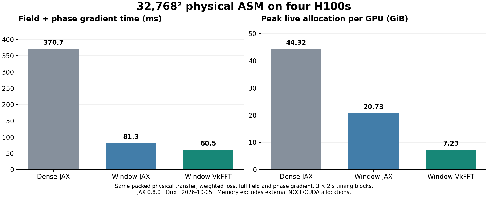
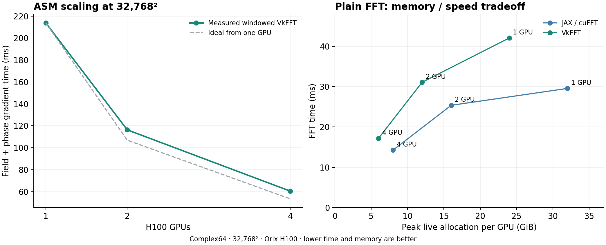

Distributed VkFFT and windowed ASM
====================================

The Orix study on 2026-10-05 produced a working differentiable tensor-parallel
prototype in ``pyvkfft.jax_distributed``. JAX owns the device mesh, exchanges,
automatic differentiation and execution buffers; VkFFT implements the local
stages. It was executed on one, two and four H100s within a node, and on two
nodes with one H100 each over InfiniBand.

For physical ASM at 32768 x 32768 on four H100s, the windowed native operator
reduced field-and-phase-gradient time from **370.7 to 60.5 ms** and maximum
per-device JAX peak live allocation from **44.32 to 7.23 GiB**, relative to
the dense distributed JAX/cuFFT baseline. Both ratios are approximately 6.1.
Relative to a JAX implementation of the same compact-window decomposition,
the native operator was 1.34 times faster and used 2.87 times less peak live
memory. Thus much of the gain comes from the decomposition; the fused native
stages provide a further improvement.

The regular LOM ``propagation_backend="vkfft"`` factories now select this
operator automatically when ``tp > 1``. The phase, complex-field and normal
DOE entry points support leading batch dimensions and combined data/tensor
parallel meshes. ``batch_axes`` maps leading dimensions to mesh axes; omitted
batch axes retain the original two-dimensional API. Singleton inputs broadcast
and reverse-mode derivatives reduce over shared input dimensions.

LOM supports complex64 H through ordinary native distributed FFTs, and fixed
packed full/window ASM or scaled RSC through the compact schedule. Use
``vkfft_grouped_batch=0``; quadrant storage remains restricted to ``tp=1``.
The distributed library can be installed with::

    python examples/asm_distributed_build.py /tmp/distributed-build --cuda /usr/local/cuda --install

An isolated build can instead be selected with
``PYVKFFT_DISTRIBUTED_FFI_LIBRARY``. The native cache initializes plans per
CUDA context without holding a cross-device lock during CUDA initialization.

Pure LOM data parallelism (``tp=1``) uses the compact single-device operator
inside an explicit DP ``shard_map``. Each rank loops over only its assigned
planes, rather than gathering and recomputing the global batch. Wavelength,
angle, object distance, propagation distance and polarization axes are
supported, with singleton constants replicated and shared-input gradients
reduced across ranks. This path uses the existing compact/streamed FFI and
also supports quadrant storage. Direct calls to ``pyvkfft.jax_asm`` do not
automatically infer a DP mesh; this routing belongs to the LOM factories.

The large-grid measurements below used the standalone single-plane API.
They do not establish end-to-end training capacity with optimizer state or
multiple optical planes.

Why the decomposition matters
-------------------------------

For a complex field of shape ``(H, W)`` distributed over ``P`` GPUs, the
ordinary slab FFT performs local row FFTs, one all-to-all, and local column
FFTs. It returns a column-sharded spectrum; the inverse reverses these steps
and returns a row-sharded field. This preserves the principle of LOM's
existing 1D-basis distributed FFT, with explicit collectives around local FFI
calls. Keeping the collectives visible to JAX avoids an opaque custom call
being replicated over the full field.

For zero-padded convolution with a cyclic transfer window, let ``K`` be its
retained frequency width and ``Kp = ceil(K/P)*P``. The compact schedule is:

1. Each GPU holds ``(H/P, W)`` input samples. Tile row padding and FFTs of
   length ``2W``; retain only ``K`` frequency columns. Extra divisibility
   columns are exactly zero.
2. Write the retained coefficients directly in destination-rank order,
   physically ``(P, H/P, Kp/P)``. Exchange contiguous rank blocks with one
   all-to-all, producing ``(H, Kp/P)`` per GPU.
3. Tile the local columns: pad to ``2H``, FFT, multiply by the local packed
   transfer coefficients, inverse FFT, and crop to ``H``. This stage can
   overwrite its input communication buffer.
4. Exchange the compact columns back. The inverse row kernel reads the
   rank-block layout directly, inserts exact spectral zeros, performs the
   inverse FFT and crops to the original width.

The native row gather/scatter removes separate rearrangement kernels around
the collectives. A forward propagation has two field all-to-alls; its field
transpose has two more. The 32768-square field-and-gradient HLO contains four
all-to-alls of local physical shape ``(4, 8192, 2327)`` and no field
all-gather. The transfer width is 9305, padded to 9308 for four devices.

Per exchange, the global complex payload decreases from ``4*H*W`` to
``H*Kp`` elements. At 32768 square this is a **14.08-fold reduction**. The
network portion excludes the rank's own block; both schedules have the same
``(P-1)/P`` factor. This payload ratio is not an expected end-to-end speedup:
the local row transforms still process the complete spatial field.

The implementation also carries forward packed SNORM16 transfer storage,
bounded FFT tiles, fused column pad/multiply/crop, unordered column FFTs with
explicit frequency mapping, the isolated inverse-upload-order fix, and
XLA-owned workspace. No additional approximation is introduced relative to
the supplied packed transfer. Its original quantization remains lossy.

Differentiation uses JAX's complex bilinear transpose convention. For the
convolution transpose, the packed window is reversed in both dimensions and
its cyclic origin is adjusted to represent ``H[-ky, -kx]``. This supports
asymmetric and wrapped windows; symmetry is not assumed. Forward-mode JVP,
reverse-mode gradients and phase Hessian-vector products are tested. Packed
coefficients and scale are fixed parameters.

Measured performance
----------------------

All following single-node measurements use H100 80GB HBM3 GPUs on Orix,
JAX/jaxlib 0.8.0 and the same physical packed transfer: 3.6 mm aperture,
520.6 nm wavelength, 10.08 mm distance, on-axis scalar field and Hann band
limit. The transfer is 9305 x 9305 uint32 values. The objective returns a
weighted output-energy loss, the full complex field and full float32 phase
gradient. Phase formation is checkpointed for every compared backend.

Each configuration runs in a fresh process. Compilation, transfer preparation
and warmup are excluded from timing. Final timings are the median of three
blocks, each at least two seconds with at least seven synchronized calls.
Memory is the maximum ``peak_bytes_in_use`` across GPUs, measured before
reference validation. It includes live preparation objects, but excludes
NCCL/CUDA allocations outside JAX. It is not the reserved allocator pool or
the whole ``nvidia-smi`` footprint.

.. list-table:: Full field and phase gradient
   :header-rows: 1
   :widths: 12 8 27 15 18

   * - Field
     - GPUs
     - Operator
     - Median ms
     - Peak GiB/GPU
   * - 18000²
     - 2
     - Dense JAX/cuFFT
     - 191.77
     - 26.88
   * - 18000²
     - 2
     - Windowed JAX/cuFFT
     - 73.49
     - 12.72
   * - 18000²
     - 2
     - Windowed VkFFT
     - 44.95
     - 5.05
   * - 32768²
     - 2
     - Dense JAX/cuFFT
     - Runtime OOM
     - —
   * - 32768²
     - 2
     - Windowed JAX/cuFFT
     - 158.33
     - 40.81
   * - 32768²
     - 2
     - Windowed VkFFT
     - 116.34
     - 13.31
   * - 18000²
     - 4
     - Dense JAX/cuFFT
     - 129.20
     - 13.60
   * - 18000²
     - 4
     - Windowed JAX/cuFFT
     - 38.15
     - 6.78
   * - 18000²
     - 4
     - Windowed VkFFT
     - 24.23
     - 2.94
   * - 32768²
     - 4
     - Dense JAX/cuFFT
     - 370.69
     - 44.32
   * - 32768²
     - 4
     - Windowed JAX/cuFFT
     - 81.25
     - 20.73
   * - 32768²
     - 4
     - Windowed VkFFT
     - 60.50
     - 7.23

The distributed implementation at 32768 square took 213.85, 116.34 and
60.50 ms on one, two and four H100s: 3.53 times faster on four devices.
The previous fused single-GPU implementation measured 224.94 ms on one H100,
giving a 3.72-fold improvement against that control.

Plain FFTs have a different tradeoff. At 32768 square on four H100s,
JAX/cuFFT measured 14.26 ms and 8.00 GiB/GPU, versus VkFFT's 17.17 ms and
6.00 GiB/GPU. On two H100s the corresponding results were 25.37/31.08 ms and
16.00/12.00 GiB. VkFFT saved 25% of live memory but did not beat cuFFT's
latency. Therefore the study does not justify replacing every distributed
FFT with VkFFT for speed.

Tile exploration covered row tiles 128–8192 for ordinary FFTs, and six
row/column tile combinations for ASM. A bounded ordinary FFT batch uses the
largest divisor of the local batch count below the requested tile size;
using the greatest common divisor with the tile size caused unnecessarily
small batches at 18000. The final ordinary FFT comparison uses a row limit
of 2048. The final ASM comparison uses 512 rows and 128 columns, balancing
runtime and memory. At 32768 square, a larger 2048/512 configuration was only
about 1.4% faster in the short tuning run while using roughly 1.5 GiB more
per GPU. These are tested settings, not a proof of a global optimum.

Larger resident fields
------------------------

.. list-table:: Four-H100 capacity demonstrations
   :header-rows: 1
   :widths: 31 19 14 18 18

   * - Workload
     - Field
     - Median s
     - Peak GiB/GPU
     - Sampled error
   * - Phase input, full field and full phase gradient
     - 131072²
     - 0.725
     - 67.50
     - 1.33e-6
   * - Donated dense forward propagation
     - 192000²
     - 0.656
     - 73.45
     - 7.07e-7

The gradient capacity case uses a single-pixel linear loss, matching the
previous single-H200 capacity protocol. It is not the weighted nonlinear
loss used in the performance table. The forward case uses a dense sum of
two plane waves, regenerates the input outside timing, and verifies reuse
of every GPU's donated field buffer on all six calls, including warmup.
Both cases use five timed calls and row/column tiles 128/64.

Validation uses an independent complex128 direct inverse DFT of the stored
transfer window at sampled positions. The forward reference uses analytical
finite sums for the input plane-wave spectra. No full reference FFT plane,
host field offload, optimizer state or extra propagation plane is present.
These are sampled large-grid validations, supplemented by complete smaller
field and gradient comparisons.

The 192000-square field contains 36.864 billion complex samples, almost
twice the pixels of the previously tested single-H200 maximum of 135828
square. The 131072-square gradient case has 1.85 times the pixels of the
previous 96250-square single-H200 gradient boundary. GPU type and device
count differ; these are capacity comparisons, not per-GPU speed claims.
No exhaustive multi-GPU maximum search was performed.

The 196608-square forward candidate was rejected by the allocation preflight:
76.56 GiB/GPU exceeded the chosen 95% allocator budget with safety margin.
The initial attempt to eagerly reserve 99% for JAX failed during NCCL
initialization. Using allocator growth, a 95% budget and a small collective
before allocating the large field completed successfully. Communication
headroom must be included; summing nominal VRAM capacities is insufficient.

Cross-node check
------------------

Slurm job 298237 ran one process/GPU on each of two H100 nodes. JAX's Slurm
discovery initialized the distributed runtime before device access, and
the same local VkFFT library was registered in each process. NCCL logs
confirmed InfiniBand and GPU Direct RDMA.

Small complete-reference errors were 2.44e-7 for FFT, 3.69e-7 for roundtrip,
4.25e-7 for propagation and 6.36e-7 for the complex gradient. At 32768 square,
a synthetic 9305-square packed window gave the following 20-call medians,
using the maximum elapsed time across ranks for each call:

.. list-table:: Two nodes, one H100 each
   :header-rows: 1

   * - Workload
     - JAX/cuFFT ms
     - VkFFT ms
   * - Ordinary FFT
     - 74.23
     - 80.11
   * - Windowed field and phase gradient
     - 214.97
     - 172.24

The windowed compiler allocation estimates were 32.48 and 12.98 GiB/GPU
respectively. These cases share a process, so cumulative runtime memory
high-water marks cannot be used as independent per-backend peaks. The
synthetic cross-node workload is not identical to the physical single-node
benchmark and should not be used to calculate a precise interconnect
slowdown. It establishes actual cross-node execution and differentiation.

Using the prototype
---------------------

Build in a fresh directory using an allocated GPU environment with the
matching CUDA toolkit and JAX:

.. code-block:: shell

   python examples/asm_distributed_build.py /path/to/fresh-build --cuda /usr/local/cuda
   export PYVKFFT_DISTRIBUTED_FFI_LIBRARY=/path/to/fresh-build/libvkfft_distributed_ffi.so

The builder copies and patches VkFFT headers in that directory. It does not
modify the submodule or replace the existing single-GPU FFI library. The
distributed library uses ABI 2.

.. code-block:: python

   import jax
   import jax.numpy as jnp
   import numpy as np
   from jax.sharding import Mesh, NamedSharding, PartitionSpec as P
   from pyvkfft.jax_distributed import fft2_factory, windowed_asm_factory

   mesh = Mesh(np.array(jax.devices()), ("tp",))
   rows = NamedSharding(mesh, P("tp", None))
   replicated = NamedSharding(mesh, P())

   # Plain FFT: row slabs -> column slabs; inverse returns row slabs.
   fft = jax.jit(fft2_factory(mesh, tile=2048))
   inverse = jax.jit(fft2_factory(mesh, inverse=True, tile=2048))

   # table is an existing LOM PackedTransferWindow, with one spatial plane.
   payload = jax.device_put(table.payload.reshape(table.shape[-2:]), replicated)
   propagate = windowed_asm_factory(
       mesh, origin=table.origin, tile_rows=512, tile_columns=128)
   phase_to_field = jax.checkpoint(
       lambda phase: jnp.exp(1j*phase).astype(jnp.complex64)/np.float32(n))

   def objective(phase, packed):
       field = propagate(phase_to_field(phase), packed, np.float32(1/32767))
       return jnp.sum(jnp.abs(field)**2 * weights), field

   value_and_grad = jax.jit(
       jax.value_and_grad(objective, has_aux=True),
       in_shardings=(rows, replicated))

The example assumes ``n`` and ``weights`` are the desired field size and
loss weights. ``examples/distributed_asm/benchmark.py`` supplies a complete
physical example, including LOM transfer preparation with
``H_sharding=None``. Window width need not divide the device count. The
standalone example keeps the public transfer argument replicated; local
column stages receive only their frequency slice. For the studied optics
this costs 0.323 GiB per GPU. The normal LOM integration instead rounds the
stored window width and prepares a persistently column-sharded transfer.

For multiple nodes, call ``jax.distributed.initialize`` before creating any
devices or arrays. The Slurm example uses one process per node and explicit
local-device selection within Slurm's assigned visibility. It never
overrides ``CUDA_VISIBLE_DEVICES``. See
``examples/distributed_asm/multihost.py`` and the archived submission script.

Supported scope is complex64 C2C FFT and fixed uint32 SNORM16 windowed
convolution, with optional leading batch dimensions. Ordinary FFT dimensions
must be divisible by the tensor-parallel count; the low-level windowed ASM
requires divisible field rows. LOM requires both spatial dimensions divisible
by that count. The native plans require supported radix sizes with at most
three uploads. Packed H and scale are fixed parameters; optical-parameter
derivatives through their quantization are unsupported. Plans are cached for
the process lifetime.

Validation and reproducibility
--------------------------------

The normal LOM integration follow-up passed eight pipeline checks on two
H100s (Orix job 298613, JAX/jaxlib 0.8.0), including five DOE updates for
complex64, packed full and packed window ASM. Fourteen distributed FFT/AD
checks and 43 single-GPU regressions also passed. Eight additional integration
checks passed on four virtual CPU devices with wavelength DP=2 and TP=2,
using JAX 0.5.3 local stages. A native four-GPU integration run was not
available; the earlier four-GPU standalone measurements remain separate.

* Ten final unit tests passed on two H100s, including full support, odd
  widths, partial tiles, wrapped asymmetric windows, input preservation,
  per-device donation, JVP, phase gradients and Hessian-vector products.
* Ten rectangular native cases passed on two and four GPUs, including
  12288-long axes. The largest relative error in the four-GPU suite was
  1.45e-6.
* Complete physical 18000-square field/gradient comparisons passed on two
  and four H100s: field error 5.31e-7 and phase-gradient error 6.92e-6.
* CPU reference tests passed with four forced devices on JAX 0.5.3. The
  native execution and performance results are from JAX 0.8.0 on Orix.

Run the isolated test file directly; importing this repository's general
test package can attempt to load an unavailable OpenCL extension:

.. code-block:: shell

   python pyvkfft/test/test_jax_distributed.py -v
   python examples/distributed_asm/validate.py --output validation.json

The environment used CUDA toolkit 12.9.1, NCCL 2.30.7+cuda12.9 and VkFFT
revision ``635b1fbc8a4b43476f4420af0a507fa93aa8af78`` with the staged inverse
fix. The final native library SHA256 is
``ace5e22bf33fb0f1e0fc3f150e88816100956c3a9eb38f57a2bf276afc460920``.
Build manifests include the wrapper and dependency revisions, source hashes,
compile commands and patch identity. All GPU computation ran in Slurm on
``freecycle-h100``; the initial H200 request was withdrawn while pending
because H100 capacity was available.

Key completed jobs are 298228/298229/298232 for final two/one/four-GPU timing,
298231 for large-field capacity, 298237 for two-node execution, and 298242
for final regressions. Failed initialization, preflight and OOM attempts
are retained alongside successful cases.

Local artifacts, including 30 audited final timing records, logs, HLO,
native libraries, figures, source snapshots and submission scripts:

``/home/weik/code/FFT/artifacts/distributed-20261005T113315Z``

Remote immutable builds and results:

``/mnt/data/u/weik/asm_runs/distributed-20261005T113315Z``

``summary.json`` is generated by ``summarize.py`` after checking log hashes,
sample medians, numerical tolerances, allocation limits and the expected
collective structure. Timing and capacity results are observations for these
workloads, not a general maximum-capacity or best-performance guarantee.

Design references
-------------------

JAX documents explicit local-shard execution and collectives in
`manual parallelism with shard_map
<https://docs.jax.dev/en/latest/201/shard-map.html>`_, and CUDA stream handling
in its `FFI guide <https://docs.jax.dev/en/latest/ffi.html>`_. The implementation
uses APIs supported by the pinned 0.8.0 runtime; current online examples may
use newer interfaces. Multi-process initialization follows the
`JAX distributed runtime guide <https://docs.jax.dev/en/latest/multi_process.html>`_.

cuFFTMp is an alternative distributed FFT engine, but its execution interfaces
require NVSHMEM-allocated buffers according to NVIDIA's
`cuFFTMp memory documentation
<https://docs.nvidia.com/cuda/cufftmp/usage/nvshmem_and_cufftmp.html>`_. Integrating
that allocator with XLA would need separate ownership and memory analysis.
It was not benchmarked here. The measured solution keeps XLA-owned buffers
and JAX/NCCL communication throughout.
